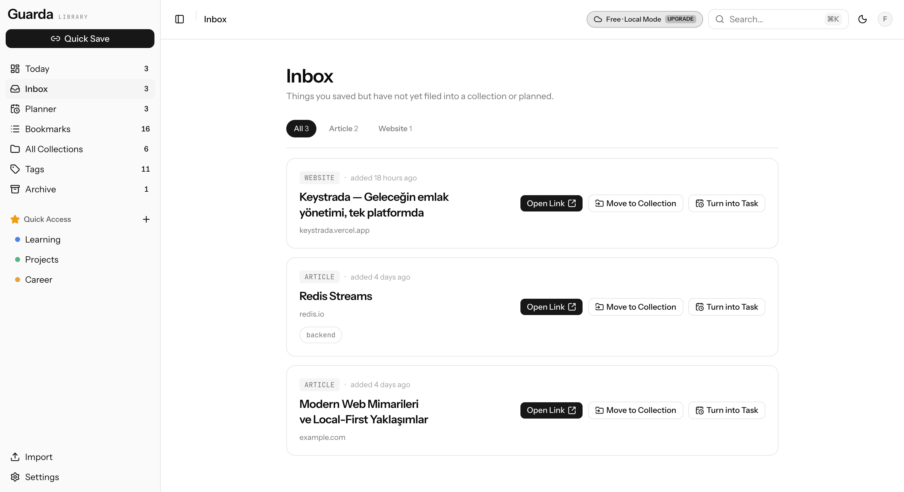
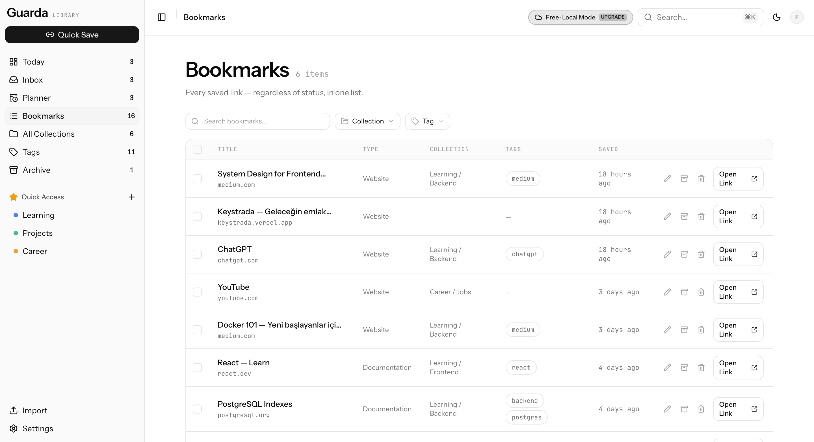
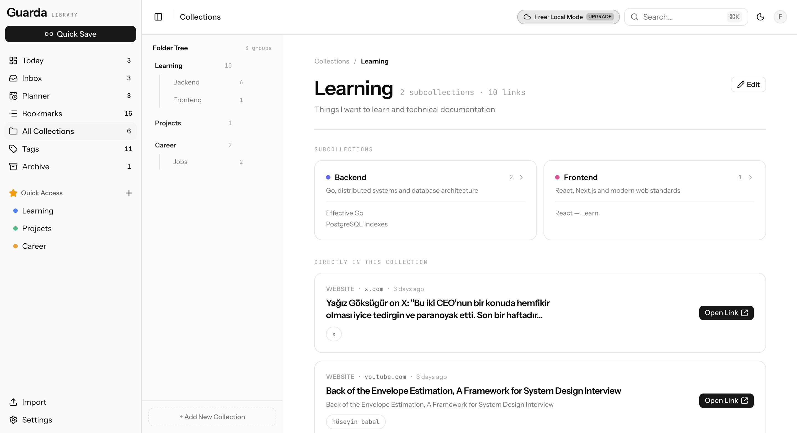
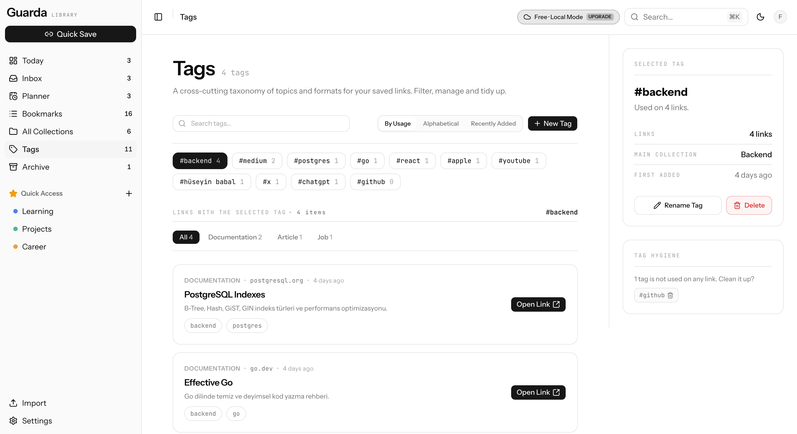
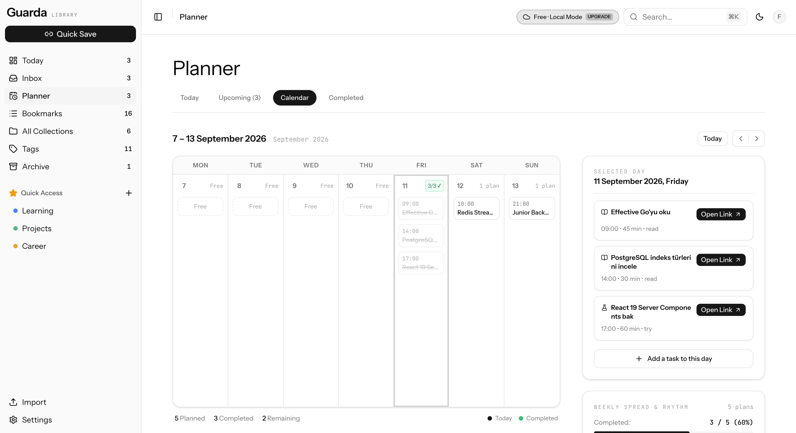

# Guarda — Landing Page

🔗 **Live Link For Free Demo:** [https://guarda-three.vercel.app/](https://guarda-three.vercel.app/)

🔗 **Live Link For Landing Page:** https://furkanturan8.github.io/guarda-landing-page/

> ℹ️ **Note:** The Chrome Extension is currently submitted and pending review on the Chrome Web Store.

The marketing site for **Guarda**, a bookmark manager and personal planner.
This repo contains the public landing page — the actual product
(frontend app, backend API) lives in a separate, private repo. This README
exists so anyone working on this site (including future-you) understands
what Guarda *is* without needing access to that other repo.

## What is Guarda?

> **Save → Organize → Plan → Complete**

Guarda solves a simple problem: people save hundreds of links and rarely
come back to them. It's a bookmark manager where a saved link can optionally
become an actionable task with a reminder — think *bookmark manager +
read-later app + lightweight personal planner*, not a Notion/Trello clone.

---

## 📸 App Preview & Core Features

### 1. 📥 Inbox
A friction-free drop zone to save links on the fly. Drop URLs here throughout the day without stopping to categorize or tag them, then organize them when you have time.

<p align="center">
  
</p>

### 2. 🔖 Bookmarks
A visual, searchable gallery of all your saved bookmarks. Automatically extracts rich metadata (page title, description, favicon, cover image, and content type: article, video, GitHub repo, documentation, etc.).

<p align="center">
  
</p>

### 3. 📁 Collections
Structure your workspace with user-defined, nestable folders (e.g. `Learning > Backend`, `Design Inspiration`, `Projects`).

<p align="center">
  
</p>

### 4. 🏷️ Tags
Fast, multi-dimensional tagging independent of folder hierarchy. Group links across collections for instant filtering.

<p align="center">
  
</p>

### 5. 📅 Planner & Tasks
Turn links into action. Convert any bookmark into a task (`Read`, `Watch`, `Apply`, `Research`, …) with scheduled dates, deadlines, and reminders to ensure you actually follow through.

<p align="center">
  
</p>

---

## Product architecture (context, not part of this repo)

Guarda ships as a **tiered, local-first** product:

| | Free | Premium |
|---|---|---|
| Data | Browser `localStorage` only | Hosted PostgreSQL, synced across devices |
| Server calls | None | Go REST API |
| AI / scraping | Off | Async metadata scraping + AI tagging/summaries |

Product stack (for reference, lives in the main repo):

- **Frontend:** Next.js (App Router) + TypeScript + Tailwind v4 + shadcn/ui
- **Backend:** Go (Fiber) REST API + PostgreSQL + Redis/asynq background
  workers
- **Extension:** browser extension for one-click quick capture

This landing page's job is to sell that product, so its copy/screenshots
need to stay truthful to the Free/Premium split above (e.g. don't promise
AI features as if they're free).

### Project Structure (`workspace/guarda`)

```text
guarda/
├── frontend/                     # Next.js (App Router) client web application
│   ├── app/                      # Page routes: (app) dashboard/views, (auth) login & signup
│   ├── components/               # Modular UI components
│   │   ├── bookmarks/            # Bookmark card/list view, metadata preview
│   │   ├── collections/          # Nested folder tree, collection management
│   │   ├── inbox/                # Quick-capture unprocessed links
│   │   ├── planner/              # Daily task planning, scheduling & reminders
│   │   ├── tags/                 # Tag badges, chip selector, multi-tag filtering
│   │   ├── capture/              # Rapid URL capture modal/bar
│   │   └── ui/                   # Reusable base components (shadcn/ui)
│   ├── hooks/                    # Custom React hooks (task completion, responsive design)
│   ├── lib/                      # Core business logic & storage adapters
│   │   ├── local-storage.ts      # Local-first storage engine (Free tier offline mode)
│   │   ├── api.ts                # REST API client for cloud sync (Premium tier)
│   │   ├── link-preview.ts       # Client-side URL metadata scraper & parser
│   │   └── extension-bridge.ts   # PostMessage bridge for browser extension
│   └── types/                    # TypeScript interfaces & extension message protocols
│
├── backend/                      # Go (Fiber) REST API & Background Worker
│   ├── cmd/                      # Application entry points
│   │   ├── server/               # HTTP API server entry point
│   │   ├── worker/               # Background queue consumer (Redis/asynq)
│   │   ├── migrate/              # Database migration runner
│   │   └── seed/                 # Development sample data seeder
│   ├── internal/                 # Clean Architecture domain logic
│   │   ├── handler/              # HTTP request handlers / controllers
│   │   ├── service/              # Core business rules & services
│   │   ├── repository/           # PostgreSQL database query layer
│   │   ├── model/                # Data structures & database models
│   │   ├── dto/                  # Request & response data transfer objects
│   │   ├── middleware/           # Auth (JWT), CORS, error handling
│   │   ├── worker/               # Background jobs (async scraping, AI enrichment)
│   │   └── router/               # Route registrations
│   ├── pkg/                      # Reusable helper packages (db, cache, logger, errorx)
│   ├── migrations/               # PostgreSQL schema migration files (SQL)
│   └── docker-compose.yml        # Local services (PostgreSQL, Redis)
│
├── extension/                    # Cross-browser extension (Manifest V3)
│   ├── manifest.json             # Chrome MV3 manifest configuration
│   ├── manifest.firefox.json     # Firefox manifest compatibility
│   └── src/
│       ├── background.ts         # Service worker: sync, badge status, hotkeys
│       ├── content/              # In-page capture overlay & page metadata scraper
│       └── options/              # Extension settings & keyboard shortcut config
│
└── docs/                         # Architecture guides, OpenAPI spec, and design docs
```

## Getting Started

Run the landing page locally:

```bash
# Install dependencies
npm install

# Start development server
npm run dev

# Build static production bundle
npm run build
```

Open [http://localhost:3000](http://localhost:3000) to preview the site.

